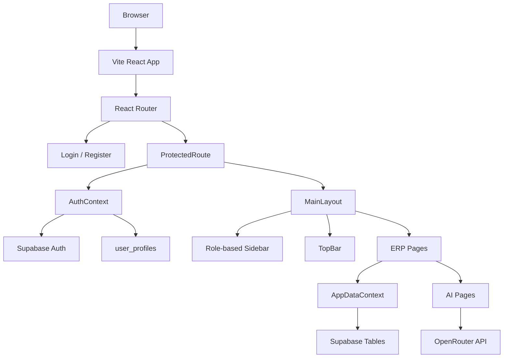

# CyberMilo ERP - Project Audit and Market Gap

Last checked: 2026-05-31

## Current Architecture

## Working Areas

- React/Vite app builds successfully.
- Supabase auth integration exists.
- Protected routing exists.
- Main ERP routes exist for dashboard, students, fees, attendance, exams, LMS, communication, transport, admissions, AI tools, settings, and profile.
- Shared UI components exist: buttons, inputs, select, modal, cards, avatar, notifications.
- Supabase schema includes tenant-oriented RLS policies.
- Dashboard loads core operational metrics from Supabase.

## Fixed Issues

- Removed broken navigation targets from role menus.
- Fixed dashboard quick actions that pointed to missing routes.
- Reworked login input icons so they no longer overlap placeholder text.
- Replaced the missing forgot-password route with an in-place notification.
- Updated the protected-route loading screen to match the new UI theme.
- Restarted Vite so `localhost:5173` serves the current build.

## Remaining Issues

- Some pages are functional but not yet fully product-grade workflows.
- No verified demo data seed flow exists.
- No public demo login exists for sales/presentation.
- No automated browser screenshot tests exist.
- `supabase_schema.sql` and `webapp/DATABASE_SCHEMA.sql` should be reconciled into one source of truth.
- AI features need clearer guardrails, saved outputs, and admin-visible audit history.
- Parent/mobile app experience is not implemented.
- Fee payment gateway integration is not implemented.
- WhatsApp/SMS communication integration is not implemented.
- Report cards, timetable, payroll, HR, inventory, library, and certificate generation are missing.

## Market Gap

Most school ERP products compete on these baseline modules:

- Admissions
- Attendance
- Fees and online payments
- Exams and report cards
- LMS/homework
- Parent communication
- Transport
- Analytics
- Mobile/parent app
- AI insights or automation

CyberMilo already has the skeleton for many of these, but it needs stronger depth, polish, and automation to feel unique.

## Differentiation Plan

1. Add a guided command dashboard with daily school health, urgent fee dues, attendance anomalies, pending admissions, and unread parent messages.
2. Add AI-generated parent messages for fee reminders, attendance alerts, and performance summaries.
3. Add fee recovery intelligence: risk score, recommended action, last-contact history, and one-click WhatsApp draft.
4. Add student 360 profile: academics, attendance, fees, behavior, parent contacts, documents, and AI summary.
5. Add demo mode with seeded data so the app looks alive immediately.
6. Add report-card builder and printable PDFs.
7. Add WhatsApp/SMS notification integration.
8. Add parent portal/mobile-first screens.
9. Add audit logs and activity timelines on every important entity.
10. Add Playwright visual checks for login, dashboard, students, fees, and attendance.

## Completion Estimate

- Current app shell and module foundation: 55-65 percent complete.
- Production-ready ERP: 35-45 percent complete.
- Market-differentiated ERP: 20-30 percent complete.

The project has a good base, but the next step should be workflow depth rather than more surface-level styling.
